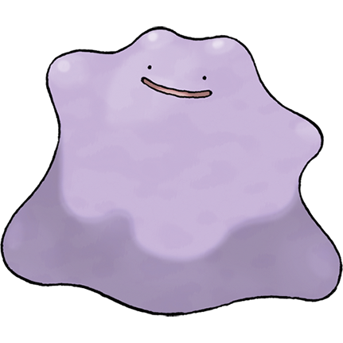
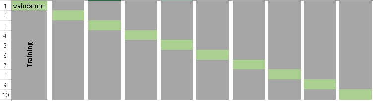

```{r setup, include=FALSE}
library(knitr)
library(tidyverse)
library(ggpubr)
library(gam)
conflicted::conflict_prefer("filter", "dplyr")

options(htmltools.dir.version = FALSE,
        tibble.width = 70,
        ggplot2.continuous.colour = "viridis",
        ggplot2.continuous.fill = "viridis")
opts_chunk$set(
  fig.width = 6.5,
  fig.height = 4.5,
  fig.align = "center",
  cache = TRUE
)
theme_set(theme_minimal() +
            theme(text = element_text(size = 20))) 
```

# Set-up

Download the exercises if you haven't already.

```{r eval = FALSE}
usethis::use_course("http://bit.ly/eds-random")
```

---

# What is randomization? 

Randomization = the process of making something random

--

Today, we'll be discussing randomization in _statistical sampling_

.center[
.img-small[
[
](https://wilkelab.org/ungeviz/index.html)
]
]
---

# Make your randomization _reproducible_

```{r}
set.seed(20180313)
```

--

```{r}
snacks <- c("pretzels", "cookies", "popcorn", "bamba", "carrots")
sample(snacks, 3)
```


---
class: exercise

# Exercise

Run this code several times:

```{r eval = FALSE}
set.seed(20180313)
snacks <- c("pretzels", "cookies", "popcorn", "bamba", "carrots")
sample(snacks, 3)
```

What happens when you run `set.seed()` each time? What happens when you only run the last line?

--

_If you use the same seed, you should be getting the same results as us!_
---
# Sampling with replacement

```{r error = TRUE}
sample(snacks, 10)
```

--

```{r}
sample(snacks, 10, replace = TRUE)
```

---

# Sample probabilities

```{r}
sample(snacks, 10, replace = TRUE,
       prob = c(.8, .05, .05, .05, .05))
```

.center[.img-small[

]]

---

# Shortcut: use an integer instead of a vector

```{r}
sample(5)
sample(1:5)
```

---
class: center, inverse, middle

# `?Distributions`
---

# Types of distributions

- **d**xxx - density/mass function
- **p**xxx - cumulative distribution function
- **q**xxx - quantile function
- **r**xxx - random generation

---

# Uniform distribution 

```{r}
tibble(x = runif(1000)) %>% #<<
  ggplot(aes(x)) + geom_histogram(bins = 50)
```

---
# Normal distribution

```{r}
tibble(x = rnorm(1000)) %>% #<<
  ggplot(aes(x)) + geom_histogram(bins = 50)
```

---
# Binomial distribution

```{r}
tibble(x = rbinom(1000, 1, prob = .7)) %>% #<<
  ggplot(aes(x)) + geom_histogram(bins = 50)
```

---

class: exercise

# Exercise

How would you use the density functions to create the following plot, which has mean = 2 and SD = 1?

```{r echo = FALSE}
tibble(x = seq(0, 5, by = 0.1),
       y = dnorm(x, mean = 2, sd = 1)) %>% 
  ggplot(aes(x, y)) +
  geom_line()
```

Hint: Set the x-values to `seq(0, 5, by = 0.1)`

---
class: middle, center, inverse

# Null models
---
# What are null models?

_A null model is a pattern generating model that is based on randomization of…data or random sampling from a known or imagined distribution. The null model is designed with respect to some ecological or evolutionary process of interest._

.pull-left[

]

.pull-right[
Gotelli & Graves 1996

_Null models in ecology_
]
---
# Why use them?

1) Assumptions of classical statistical tests are often not met

2) Random processes may result in non-random patterns

_Note:_ Null models will not solve problems with homogeneity of variance!

.center[

]

---
# How to prepare your own null model in 5 easy steps!

.pull-left-big[
1) Collect data

2) Break the structure in the data. Replace the process of interest with a random draw

3) Repeat many, many, many times

4) Collate all the repetitions to generate a null distribution

5) Compare observed pattern to random pattern expected by chance
]

.pull-right-small[
.center[

]
]
---
# Example:

Do grey Pokemon have higher defense values than other pokemon?

```{r message=FALSE}
library(tidyverse)
pokemon <- read_csv("data/pokemon.csv")
```

---

We can run a simple t-test to find out:

```{r}
pokemon <- pokemon %>%
  mutate(color2 = if_else(color == "Grey", "Grey", "Not_grey"))

t.test(defense ~ color2, pokemon)
```
--
The answer is: yes, they do.
---
# Now let's do it with a null model instead!

1) A numeric value: how many observations are in our group of interest?
```{r}
n_grey <- sum(pokemon$color2 == "Grey")
```
--

2) A vector containing the pooled observations.
```{r}
pooled_obs <- pokemon$defense
```
--

3) An empty vector in the length of however many iterations we want to run.
```{r}
t <- vector(length = 10000)
```

---

4) This is our null model - for each iteration, we randomly sample our `pooled_obs` to create simulated `grey` and `not_grey` groups, then calculate a t-score. After running this process for `t` iterations, we get a null distribution of t-scores.

```{r}
for (i in 1:length(t)){
  # sample WITHOUT replacement
  grey_idx <- sample(length(pooled_obs), n_grey, 
                     replace = FALSE)
  
  # create simulated grey & not_grey groups
  grey <- pooled_obs[grey_idx] 
  not_grey <- pooled_obs[-grey_idx]
  
  # calculate t-score
  t[i] <- t.test(grey, not_grey)$statistic
}
```

---

Now that we have a null distribution, we can calculate the **observed t-score**:

```{r}
(poke_sum <- pokemon %>%
   group_by(color2) %>%
   summarise(
     mean = mean(defense),
     se = sd(defense) / sqrt(n())
   ))
(obs <- (poke_sum$mean[2] - poke_sum$mean[1])/poke_sum$se[2])
```

---

And of course, a **p-value**.
This is calculated as the precentage of t-scores in the null distribution as extreme, or more extreme, than the observed t-score.

```{r}
p.val <- sum(abs(t) >= abs(obs)) / length(t)
p.val
```
---

Now let's visualize this. We'll plot the histogram of the null distribution, and mark our observed value with a red line: We can see clearly that our observed t-score is very, very extreme.

```{r}
tibble(scores = t, obs = obs) %>%
  ggplot() +
  geom_density(aes(scores)) + 
  geom_vline(xintercept = obs, color = "red")
```

---

Now we can start adding complications. For instance, you may recall that _grey_ Pokemon tend to be _steel_ type.

.center[


]

How do we incorporate this into our null model?
---
# Weighted sampling

One of the things we can do is to construct our model with sampling that is _weighted_ according to another variable, rather than randomly.  

--

In this case, we would give a higher probability to selecting a steel type Pokemon when generating our "grey" group.

_How much higher?_ 

For this example, we can base the probability on the distribution of types of *all* grey Pokemon, to make sure our simulated "grey" group has a similar distribution of types as our observed group.
---
```{r}
grey_prop <- pokemon %>% 
   filter(color2 == "Grey") %>%
   count(type_1) %>% 
   mutate(prop = n/sum(n))

grey_prop
```
---

Let's add the proportions back into our data frame.

```{r}
pokemon <- left_join(pokemon, grey_prop, by = "type_1") %>% 
  mutate(prop = replace_na(prop, 0))
```

...and then we can calculate our null distribution again, using weighted probabilities.  We'll store the null distributions in a new variable, `t2`. 
---
```{r}
n_grey <- sum(pokemon$color2 == "Grey")
pooled_obs <- pokemon$defense
t2 <- vector(length = 10000) 
prop <- pokemon$prop #<<
```

```{r}
for (i in 1:length(t2)){
  grey_idx <- sample(length(pooled_obs), n_grey, 
                     replace = FALSE, 
                     prob = prop) #<<
  
  grey <- pooled_obs[grey_idx] 
  not_grey <- pooled_obs[-grey_idx]
  
  t2[i] <- t.test(grey, not_grey)$statistic
}
```

---
```{r}
tibble(scores = t2, obs = obs) %>%
  ggplot() +
  geom_density(aes(scores)) + 
  geom_vline(xintercept = obs, color = "red")
```

In this case the results are basically the same, still a significant difference.
---

class: exercise

# Exercise

How do you plot both distributions on the same graph? What does this tell you about the distributions?

```{r echo = FALSE}
tibble(random = t, weighted = t2) %>%
  gather("model", "scores") %>%
  ggpubr::ggdensity(x = "scores", fill = "model")
```

---
# Biases

There are two main issues that can occur when constructing null models, and we should always be aware of them:

.center[

]
---

# 1) Narcissus effect
### (Colwell & Winkler 1984)

.pull-left[
The null model algorithm includes the effect it was trying to omit.

## INFLATED TYPE II ERROR RATE!

_'Narcissus could not see the bottom of the pool for his own image, and could not guess its depth.'_
]

.bottom-right[

]
---
#2) Jack Horner effect
### (Wilson 1995)

.pull-left[
The null model algorithm omits effects it shouldn't.

##INFLATED TYPE I ERROR RATE!

_'Jack Horner...thought himself a good boy for demonstrating that plum pies contain plums.'_

]

.bottom-right[

]
---
# Take home

Null models are powerful!!!

1) They can be tailor-made to fit any type of data/question;

2) They require _zero_ assumptions about the underlying structure of the data;

But you have to use your brain, even more than usual!

.bottom-right[

]

---
class: inverse, middle, center

# Cross-validation
---

# Cross-validation!

Cross-validation is a useful tool to test how good your model is. How?

1) Divide your data into a training set and a test (validation) set. _This is where randomization is important!_

2) Build your model using the training set.

3) Test your model predictions on the test set!

_A good model will give good predictions on the testing set._

---

# There are many different methods for cross-validation.

Many rely on randomly sampling part of your data to divide it into a training and test set, and repeating the process many times to eventually average the measure of how good the model is across all iteration.

##Sounds familiar?

.bottom-right[
.img-small[

]
]
---

```{r}
library(caret)
```

We are going to be using this package for our cross-validation purposes, although it's useful for many other things to do with predictive modeling, and it interfaces with a ton of other packages.

Look into it:
http://topepo.github.io/caret/

.bottom-right[

]

---
class: exercise

# Exercise

Which model best predicts the relationship between _attack_ and _special defense_ scores of Pokemon?

.center[


]

---

Let's begin with a scatterplot:
```{r}
pokemon %>% 
    ggplot(aes(attack, sp_def)) +
    geom_point()
```

---

We can see that there is a somewhat linear relationship between the two variables. So we can try to fit three types of models:

1) a linear model.

1.5) a linear model with a quadratic term.

2) a general additive model with loess smoothing.

---

```{r}
model1 <- lm(sp_def ~ attack, data = pokemon)
pokemon %>% 
    ggplot(aes(attack, sp_def)) +
    geom_point() +
    geom_smooth(method = "lm")
```

---

```{r}
model1.5 <- lm(sp_def ~ I(attack^2), data = pokemon)
pokemon %>% 
    ggplot(aes(attack, sp_def)) +
    geom_point() +
    geom_smooth(method = "lm", formula = y ~ I(x^2))
```

---

```{r}
model2 <- gam(sp_def ~ lo(attack), data = pokemon)
pokemon %>% 
    ggplot(aes(attack, sp_def)) +
    geom_point() +
    geom_smooth(method = "loess")
```

---
class: inverse, middle, center

## Which model is better?

---

# k-folds cross-validation

1) Randomly split your entire dataset into _k_ ”folds”.

2) For each _k_-fold, build your model on _k_ – 1 folds of the dataset. Then, test the model on the _k_ th fold.

3) Save the error of the model for each _k_-fold.

4) Repeat until each of the _k_-folds has served as the test set.

5) The average of the _k_ errors is  the <b>cross-validation error</b> - the lower this value is, the better your model.

---

# k-folds cross-validation

.center[

]

---

```{r}
train_control <- trainControl(method="cv", number=10)
```

This function determines how we create training sets.

_method_ determines which method to use. "cv" gives us k-folds cross-validation, and _number_ determines how many _k_ folds we choose.

<b>Selecting the correct _k_ is not trivial at all, and will affect your results!</b> For now let's use 10.

.center[

]
---

```{r message=FALSE, warning=FALSE}
model1 <- train(sp_def ~ attack,
                data = pokemon,
                trControl = train_control,
                method = "lm")

model1.5 <- train(sp_def ~ I(attack^2),
                  data = pokemon,
                  trControl = train_control,
                  method = "lm")

model2 <- train(sp_def ~ attack,
                data = pokemon,
                trControl = train_control,
                method = "gamLoess")
```

_train_ is the function to actually run the cross-validation process, using the control parameters we set up with _trainControl_.

_method_ determines the model we use - there are many!

---

```{r}
model1
```

---

```{r}
model1.5
```

---

```{r}
model2
```

---

We choose the model with the lowest average error across all _k_ iterations - in this case, <b>model2</b> with an average RMSE of _26.31513_.

Out of our three options, this model performed best in the cross-validation process.

.right[

]
---

# Take home

Cross-validation can be useful. <b>Use it!</b>

.center[

]
